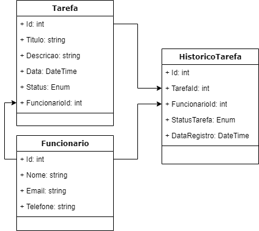
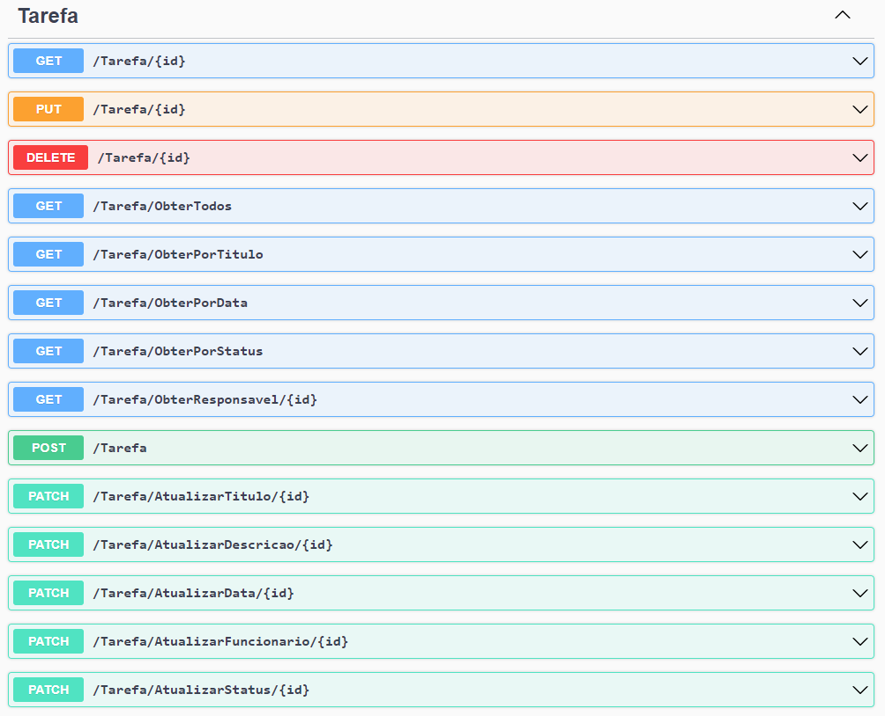
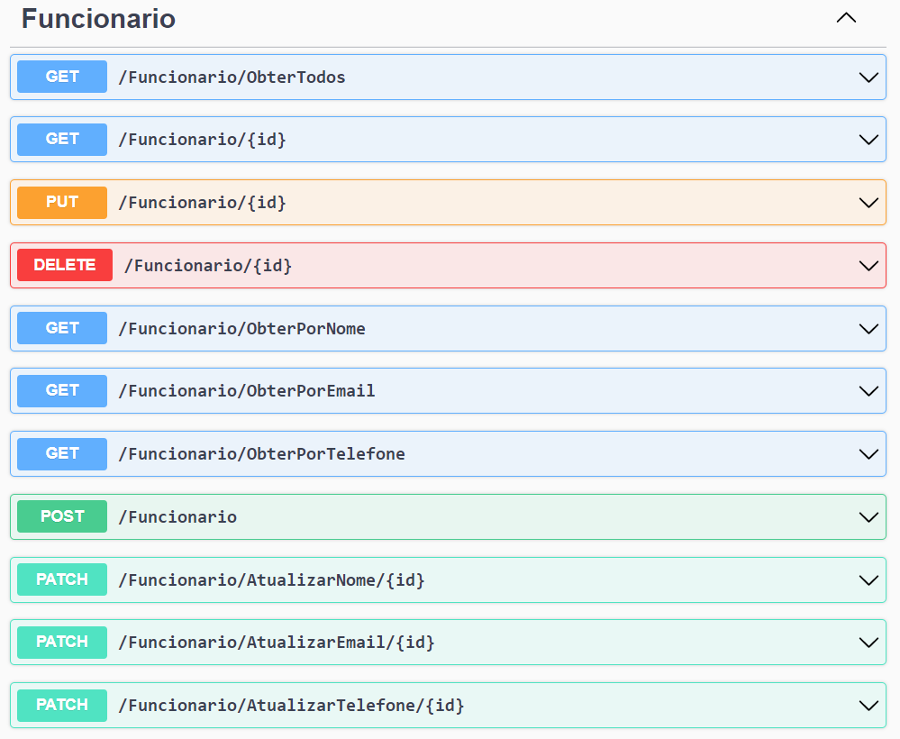
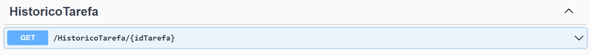
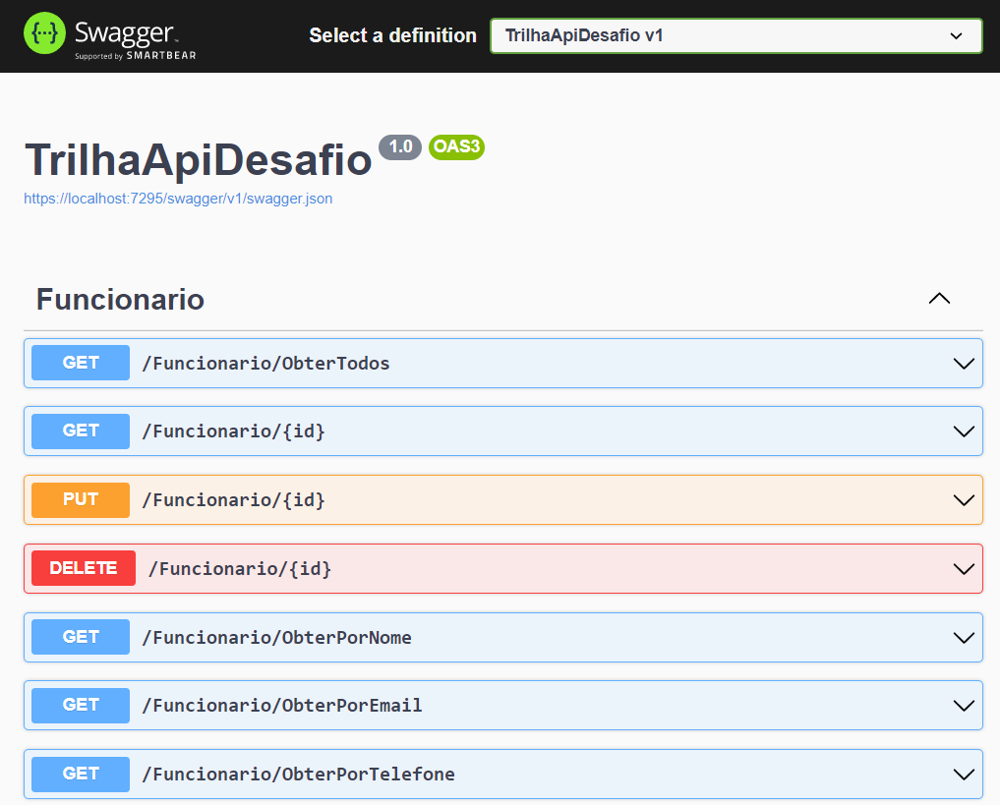

# DIO - Trilha .NET - API e Entity Framework
www.dio.me

## Desafio de projeto
Para este desafio, você precisará usar seus conhecimentos adquiridos no módulo de API e Entity Framework, da trilha .NET da DIO.

## Contexto
Você precisa construir um sistema gerenciador de tarefas, onde você poderá cadastrar uma lista de tarefas que permitirá organizar melhor a sua rotina.

Essa lista de tarefas precisa ter um CRUD, ou seja, deverá permitir a você obter os registros, criar, salvar e deletar esses registros.

A sua aplicação deverá ser do tipo Web API ou MVC, fique a vontade para implementar a solução que achar mais adequado.

A sua classe principal, a classe de tarefa, deve ser a seguinte:


Não se esqueça de gerar a sua migration para atualização no banco de dados.

## Métodos esperados
É esperado que você crie o seus métodos conforme a seguir:


**Swagger Original**


**Endpoints Originais**


| Verbo  | Endpoint                | Parâmetro | Body          |
|--------|-------------------------|-----------|---------------|
| GET    | /Tarefa/{id}            | id        | N/A           |
| PUT    | /Tarefa/{id}            | id        | Schema Tarefa |
| DELETE | /Tarefa/{id}            | id        | N/A           |
| GET    | /Tarefa/ObterTodos      | N/A       | N/A           |
| GET    | /Tarefa/ObterPorTitulo  | titulo    | N/A           |
| GET    | /Tarefa/ObterPorData    | data      | N/A           |
| GET    | /Tarefa/ObterPorStatus  | status    | N/A           |
| POST   | /Tarefa                 | N/A       | Schema Tarefa |

Esse é o schema (model) de Tarefa, utilizado para passar para os métodos que exigirem

```json
{
  "id": 0,
  "titulo": "string",
  "descricao": "string",
  "data": "2022-06-08T01:31:07.056Z",
  "status": "Pendente"
}
```


## Solução Original
O código está pela metade, e você deverá dar continuidade obedecendo as regras descritas acima, para que no final, tenhamos um programa funcional. Procure pela palavra comentada "TODO" no código, em seguida, implemente conforme as regras acima.

## Solução Realizada
O código realizado foi referente a uma web API, visto que o bootcamp possui um foco no Back-End.
Após realizar o que foi pedido, eu criei duas novas entidades, a Funcionario e a HistoricoTarefa, na primeira eu possuo informações sobre os trabalhadores da empresa, como o nome, telefone e e-mail, ela se relaciona com a entidade Tarefa através de chave estrangeira.
A entidade HistoricoTarefa é utilizada como um registro das atividades realizadas na tarefa (possui chave estrangeira de Tarefa e Funcionario), ou seja, através dela é possível saber quem trabalhou em determinada tarefa, em qual status que atuou e quando. Ela tem apenas um endpoint liberado para o cliente, que seria o GET por id da tarefa, sendo assim, não é possível que o usuário adicione, altere ou delete os dados do histórico, dessa forma é garantida a rastreabilidade no fluxo das tarefas.
É são criados novos rastros no histórico quando uma tarefa é criada, atualizada por PUT, atualizada o status, funcionarioId pelo PATCH ou quando é removida, sempre de forma automática pelo sistema. 

## Diagrama Realizado


## Swagger Criado




## Endpoints Criados

### Tarefa

| Verbo  | Endpoint                          | Parâmetro         | Body          |
|--------|-----------------------------------|-------------------|---------------|
| GET    | /Tarefa/{id}                      | id                | N/A           |
| PUT    | /Tarefa/{id}                      | id                | Schema Tarefa |
| DELETE | /Tarefa/{id}                      | id                | N/A           |
| GET    | /Tarefa/ObterTodos                | N/A               | N/A           |
| GET    | /Tarefa/ObterPorTitulo            | titulo            | N/A           |
| GET    | /Tarefa/ObterPorData              | data              | N/A           |
| GET    | /Tarefa/ObterPorStatus            | status            | N/A           |
| GET    | /Tarefa/ObterResponsavel          | id                | N/A           |
| POST   | /Tarefa                           | N/A               | Schema Tarefa |
| PATCH  | /Tarefa/AtualizarTitulo/{id}      | id, titulo        | N/A           |
| PATCH  | /Tarefa/AtualizarDescricao/{id}   | id, descricao     | N/A           |
| PATCH  | /Tarefa/AtualizarData/{id}        | id, data          | N/A           |
| PATCH  | /Tarefa/AtualizarFuncionario/{id} | id, idFuncionario | N/A           |
| PATCH  | /Tarefa/AtualizarStatus/{id}      | id, status        | N/A           |

Esse é o schema (model) de Tarefa, utilizado para passar para os métodos que exigirem

```json
{
  "id": 0,
  "titulo": "string",
  "descricao": "string",
  "data": "2022-10-18T00:46:28.447Z",
  "status": "Pendente",
  "funcionarioId": 0
}
```

### Funcionario

| Verbo  | Endpoint                             | Parâmetro     | Body               |
|--------|--------------------------------------|---------------|--------------------|
| GET    | /Funcionario/{id}                    | id            | N/A                |
| PUT    | /Funcionario/{id}                    | id            | Schema Funcionario |
| DELETE | /Funcionario/{id}                    | id            | N/A                |
| GET    | /Funcionario/ObterTodos              | N/A           | N/A                |
| GET    | /Funcionario/ObterPorNome            | nome          | N/A                |
| GET    | /Funcionario/ObterPorEmail           | email         | N/A                |
| GET    | /Funcionario/ObterPorTelefone        | telefone      | N/A                |
| POST   | /Funcionario                         | N/A           | Schema Funcionario |
| PATCH  | /Funcionario/AtualizarNome/{id}      | id, nome      | N/A                |
| PATCH  | /Funcionario/AtualizarEmail/{id}     | id, email     | N/A                |
| PATCH  | /Funcionario/AtualizarTelefone/{id}  | id, telefone  | N/A                |

Esse é o schema (model) de Funcionario, utilizado para passar para os métodos que exigirem

```json
{
  "id": 0,
  "nome": "string",
  "email": "string",
  "telefone": "string"
}
```

### HistoricoTarefa

| Verbo  | Endpoint                             | Parâmetro     | Body               |
|--------|--------------------------------------|---------------|--------------------|
| GET    | /HistoricoTarefa/{idTarefa}          | idTarefa      | N/A                |

## Vídeo

Criei um vídeo mostrando o projeto e explicando seu código, ele está presente nesse link:

[](https://youtu.be/OT9Wv4khTPQ)

Link: https://youtu.be/OT9Wv4khTPQ

## Agradecimentos

Sou extremamente grato a **Digital Innovation One** e a **Pottencial** por essa oportunidade de bootcamp, agradeço também ao professor **Leonardo Buta**, sua ditática é muito boa, fato é que seus ensinamentos me possibilitaram ir além do que foi pedido!